# Data Model & ERD
## Software Pembukuan Mudah dengan Mesin Akuntansi Standar IFRS/PSAK

**Lampiran PRD** — Software Pembukuan Mudah dengan Mesin Akuntansi Standar IFRS/PSAK  
**Versi:** 1.9 — Review  
**Tanggal:** 2026-08-06  
**Status:** Review  
**Owner:** Engineering + Accounting  
**Normative:** Ya untuk persistence constraints

---

## 1. Konvensi Umum

| Aspek | Konvensi |
|---|---|
| **ID** | `BIGSERIAL` per tabel; tipe `BIGINT` |
| **Tenant** | Hampir semua tabel bisnis punya `tenant_id BIGINT NOT NULL REFERENCES tenants(id)` — isolasi RLS |
| **Money** | Seluruh nominal `BIGINT` satuan **sen** (Rupiah × 100) — kolom diakhiri `_cents` |
| **Kurs/Rate** | `NUMERIC(18,6)` — kolom diakhiri `_rate` |
| **Timestamp** | `TIMESTAMPTZ` default `now()`; `created_at`, `updated_at` |
| **Soft delete** | **Tidak ada** — data akuntansi tidak pernah dihapus permanen; gunakan `status = 'VOID'` / `is_active = false` |
| **Audit** | Setiap perubahan signifikan → `audit_logs` (append-only) |
| **Enum** | `TEXT` + `CHECK` constraint (fleksibel & mudah migrasi) |
| **Status posting** | `journal_entries.status = 'POSTED' \| 'VOID'` — VOID menyimpan jurnal balik, tidak menghapus |

### Konvensi Field
- **Tipe field konsisten:** `id` = BIGSERIAL; `qty` = `NUMERIC(18,3)`; `persentase` = `NUMERIC(9,6)`; `nominal` = BIGINT `_cents`; `tanggal` = DATE; `timestamp` = TIMESTAMPTZ.
- **Foreign key** selalu `REFERENCES <tabel>(id)` + `ON DELETE RESTRICT` (tidak pernah cascade untuk data akuntansi).
- **Kolom audit** `created_at`/`updated_at` TIMESTAMPTZ default `now()` pada semua tabel bisnis (dianggap ada — tidak diulang tiap tabel).
- **Terminologi:** "Hutang" = liabilitas (payable); "Piutang" = aset (receivable). Nama kolom & enum memakai bahasa Inggris konsisten (`payable_cents`, `receivable_cents`).

---

## 2. ERD Ringkas (ASCII)

```
tenants ─┬─< user_tenants >─ users
         ├─< accounting_periods
         ├─< accounts (parent_id → accounts self-ref: grup→detail)
         │        └< report_mappings (akun → baris laporan)
         ├─< ledger_chain_heads (serialisasi hash chain per tenant)
         ├─< payment_terms (master termin) ─< customers / suppliers
         ├─< customers ─< invoices ─< invoice_lines
         │        └< sales_quotations ─< sales_orders ─< down_payments
         │              └< deliveries ─< invoice_lines? (via delivery_lines)
         ├─< suppliers ─< purchase_requests ─< purchase_orders ─< grns
         │        └< supplier_invoices ─< payments (ap)
         ├─< items ─< inventory_movements (batch_ref utk FIFO)
         ├─< item_price_lists (harga jual multi-level)
         ├─< fixed_assets
         ├─< jobs ─< job_costs ; bom (item_id ref)
         ├─< recurring_templates ─< journal_entries (source_ref)
         ├─< bank_statements ─< bank_statement_lines ─< journal_entries
         │        └< bank_reconciliations
         ├─< budgets ─< budget_lines
         ├─< dimensions ; locations
         ├─< categories (pemetaan kategori → akun)
         ├─< templates (jurnal cepat)
         ├─< petty_cash (kas kecil imprest)
         ├─< leases (PSAK 73)
         ├─< consolidation_entities (entitas konsolidasi)
         ├─< transfers (pindah kas/bank)
         ├─< stock_opnames (stok opname)
         ├─< write_offs (penghapusan piutang)
         ├─< attachments ─< journal_entries (polymorphic via owner)
         └─< audit_logs (tenant-scoped, append-only)

journal_entries ─< journal_lines >─ accounts
      │              └ dimension_ids JSONB
      └─< outbox_events
      └─< pending_documents (checklist tutup buku)
```

### 2.2 ERD Visual (Mermaid)

```mermaid
erDiagram
    TENANTS ||--o{ USER_TENANTS : "memiliki"
    USERS ||--o{ USER_TENANTS : "terdaftar di"
    USERS ||--o{ USER_TOKENS : "sesi"
    TENANTS ||--o{ ACCOUNTS : "COA"
    ACCOUNTS ||--o{ ACCOUNTS : "parent (grup→detail)"
    ACCOUNTS ||--o{ REPORT_MAPPINGS : "baris laporan"
    TENANTS ||--o{ ACCOUNTING_PERIODS : "periode"
    JOURNAL_ENTRIES }o--|| ACCOUNTING_PERIODS : "period_id"
    JOURNAL_ENTRIES ||--o{ JOURNAL_LINES : "baris"
    ACCOUNTS ||--o{ JOURNAL_LINES : "account_id"

    TENANTS ||--o{ CUSTOMERS : "pelanggan"
    CUSTOMERS ||--o{ INVOICES : "ditagih"
    INVOICES ||--o{ INVOICE_LINES : "baris"
    CUSTOMERS ||--o{ SALES_QUOTATIONS : "penawaran"
    SALES_QUOTATIONS ||--o{ SALES_ORDERS : "dikonversi"
    SALES_ORDERS ||--o{ DOWN_PAYMENTS : "uang muka"
    SALES_ORDERS ||--o{ DELIVERIES : "pengiriman"
    INVOICES ||--o{ PAYMENTS : "pelunasan"
    INVOICES ||--o{ CREDIT_NOTES : "retur"
    INVOICES ||--o{ WRITE_OFFS : "penghapusan"

    TENANTS ||--o{ SUPPLIERS : "pemasok"
    SUPPLIERS ||--o{ PURCHASE_ORDERS : "pesanan"
    PURCHASE_ORDERS ||--o{ GRNS : "penerimaan"
    PURCHASE_ORDERS ||--o{ SUPPLIER_INVOICES : "tagihan"
    SUPPLIER_INVOICES ||--o{ PAYMENTS_AP : "pembayaran"
    SUPPLIER_INVOICES ||--o{ PURCHASE_RETURNS : "retur"

    ITEMS ||--o{ INVENTORY_MOVEMENTS : "mutasi stok"
    ITEMS ||--o{ INVENTORY_BATCHES : "lapisan FIFO"
    ITEMS ||--o{ ITEM_PRICE_LISTS : "harga"
    LOCATIONS ||--o{ INVENTORY_MOVEMENTS : "gudang"
    STOCK_OPNAMES ||--o{ STOCK_OPNAME_LINES : "baris opname"

    FIXED_ASSETS }o--|| ACCOUNTS : "account_id"
    JOBS ||--o{ JOB_COSTS : "biaya job"
    JOBS ||--o{ BOM : "komponen"

    RECURRING_TEMPLATES ||--o{ RECURRING_INSTANCES : "jadwal"
    BANK_STATEMENTS ||--o{ BANK_STATEMENT_LINES : "mutasi"
    BANK_RECONCILIATIONS ||--o{ BANK_STATEMENT_LINES : "batch"
    LEASES ||--o{ LEASE_PAYMENTS : "pembayaran"
    CONSOLIDATION_ENTITIES ||--o{ INTERCOMPANY_TRANSACTIONS : "antar-entitas"
    PETTY_CASH_FUNDS ||--o{ PETTY_CASH_TRANSACTIONS : "kas kecil"

    JOURNAL_ENTRIES ||--o{ OUTBOX_EVENTS : "event"
    JOURNAL_ENTRIES ||--o{ ATTACHMENTS : "bukti (polymorphic)"
    TENANTS ||--o{ AUDIT_LOGS : "jejak audit"
```



*(Rendered otomatis di GitHub/GitLab. Detail kolom & constraint: lihat §3.)*

**Hubungan kunci:**
- `journal_entries 1─∞ journal_lines` — satu jurnal punya banyak baris.
- `journal_lines ∞─1 accounts` — setiap baris menunjuk satu akun.
- `journal_entries ∞─1 accounting_periods` — jurnal milik satu periode.
- `journal_entries` unik pada `(tenant_id, source_ref, intent_type)` — idempotensi.
- `stock_opnames 1─∞ stock_opname_lines` — opname punya banyak baris; hasilnya → jurnal penyesuaian.
- `leases 1─∞ lease_payments` — kontrak sewa punya jadwal pembayaran.
- `consolidation_entities 1─∞ intercompany_transactions` — transaksi antar-entitas untuk eliminasi.

### 2.3 State Machine Dokumen (Ringkas)

```
Sales Order:  CONFIRMED → PARTIALLY_DELIVERED → DELIVERED → (INVOICED)
               └────────────── CANCELLED
Invoice:      DRAFT → ISSUED → PARTIALLY_PAID → PAID
               └────────────────────── VOID
Purchase Order: CONFIRMED → PARTIALLY_RECEIVED → RECEIVED
               └────────────── CANCELLED
Supplier Invoice: DRAFT → RECEIVED → PARTIALLY_PAID → PAID
               └──────────────────────── VOID
GRN:          RECEIVED → (matched) → CANCELLED/RETURNED
Delivery:     DRAFT → SHIPPED → RETURNED
               └──────── CANCELLED (sebelum SHIPPED)
Down Payment: RECEIVED → APPLIED (ke invoice) → REFUNDED
Job:          OPEN → IN_PROGRESS → COMPLETED → CANCELLED
Transfer:     RECORDED → VOID
Recurring Instance: REMINDED → POSTED → SKIPPED
```

**Aturan transisi:** transisi tidak valid ditolak engine (mis. `PAID` → `DRAFT` tidak mungkin; void hanya dari status non-final).

---

## 3. Tabel Inti

### 3.1 Tenancy & User

#### `tenants`
| Kolom | Tipe | Keterangan |
|---|---|---|
| id | BIGSERIAL PK | |
| name | TEXT NOT NULL | Nama usaha |
| slug | TEXT NOT NULL UNIQUE | Identitas URL |
| currency_code | CHAR(3) NOT NULL DEFAULT 'IDR' | Mata uang fungsional |
| fiscal_year_start | DATE | Awal tahun buku |
| period_type | TEXT CHECK (monthly/quarterly/yearly) DEFAULT 'monthly' | Periode akuntansi |
| created_at / updated_at | TIMESTAMPTZ | |

#### `users`
| Kolom | Tipe | Keterangan |
|---|---|---|
| id | BIGSERIAL PK | |
| email | TEXT NOT NULL UNIQUE | |
| password_hash | TEXT | Argon2id |
| full_name | TEXT | |
| is_active | BOOLEAN DEFAULT true | |
| created_at / updated_at | TIMESTAMPTZ | |

#### `user_tenants`
| Kolom | Tipe | Keterangan |
|---|---|---|
| id | BIGSERIAL PK | |
| user_id | BIGINT REFERENCES users(id) | |
| tenant_id | BIGINT REFERENCES tenants(id) | |
| role | TEXT CHECK (owner/accountant/admin/staff/consultant) | RBAC per tenant |
| UNIQUE (user_id, tenant_id) | | |

#### `user_tokens` (refresh token & 2FA)
| Kolom | Tipe | Keterangan |
|---|---|---|
| id | BIGSERIAL PK | |
| user_id | BIGINT REFERENCES users(id) NOT NULL | |
| token_type | TEXT CHECK (refresh/oauth/2fa) | |
| token_hash | TEXT NOT NULL | Hash refresh token (bukan token asli) |
| family_id | UUID NOT NULL | Grup rotasi — deteksi pemakaian ulang |
| expires_at | TIMESTAMPTZ NOT NULL | 30 hari untuk refresh |
| revoked_at | TIMESTAMPTZ NULL | Logout / rotasi |
| replaced_by | BIGINT NULL | Refresh token pengganti |
| ip_address / user_agent | TEXT | Untuk audit |
| created_at | TIMESTAMPTZ | |

*(Sesuai ARCHITECTURE.md §8.1: rotasi refresh token, family detection, revoke semua sesi saat abuse.)*

### 3.2 COA & Periode

#### `document_numbering` (counter nomor dokumen)
| Kolom | Tipe | Keterangan |
|---|---|---|
| id | BIGSERIAL PK | |
| tenant_id | BIGINT NOT NULL | |
| doc_type | TEXT NOT NULL | `JRN`, `INV`, `SQ`, `SO`, `DP`, `DO`, `CN`, `PO`, `GRN`, `SI`, `KK`, `BK`, `PRT`, `RCR`, `SDP`, `TRF`, `JOB`, `PR`, `WO` |
| prefix | TEXT | Mis. `INV-2026-` |
| last_seq | BIGINT DEFAULT 0 | Urutan terakhir |
| fiscal_year | INT | Per tahun buku |
| UNIQUE (tenant_id, doc_type, prefix, fiscal_year) | | |
| CHECK (last_seq >= 0) | | |

*(Diisi via sequence atomik — mencegah nomor ganda/bolong.)*

#### `accounts`
| Kolom | Tipe | Keterangan |
|---|---|---|
| id | BIGSERIAL PK | |
| tenant_id | BIGINT NOT NULL | |
| code | TEXT NOT NULL | Kode unik per tenant |
| name | TEXT NOT NULL | |
| report_group | TEXT CHECK (asset/liability/equity/revenue/expense) | Kelompok laporan |
| account_type | TEXT | Tipe akun: CASH, BANK, AR, CONTRA_RECEIVABLE, INVENTORY, FIXED_ASSET, CONTRA_ASSET, TAX_RECEIVABLE, TAX_PAYABLE, PREPAYMENT, CUSTOMER_DEPOSIT, ACCRUED_LIABILITY, LONG_TERM_LIABILITY, CREDIT_CARD, LOAN, EQUITY, REVENUE, CONTRA_REVENUE, COGS, EXPENSE, OTHER_EXPENSE, OTHER_INCOME, OTHER_ASSET, OTHER_RECEIVABLE |
| parent_id | BIGINT REFERENCES accounts(id) | Grup → detail |
| is_group | BOOLEAN DEFAULT false | Hanya detail yang boleh diposting |
| is_active | BOOLEAN DEFAULT true | |
| valid_from / valid_to | DATE NULL | Periode berlaku (opsional) |
| UNIQUE (tenant_id, code) | | |

#### `report_mappings` (pemetaan akun → baris laporan)
| Kolom | Tipe | Keterangan |
|---|---|---|
| id / tenant_id | | |
| account_id | BIGINT REFERENCES accounts(id) NOT NULL | |
| report_type | TEXT CHECK (balance_sheet/profit_loss/cash_flow) | |
| report_line | TEXT | Baris laporan (mis. `asset.current.cash`, `revenue.sales`) |
| priority | INT DEFAULT 100 | Urutan pemetaan |
| UNIQUE (tenant_id, account_id, report_type) | | |

*(Akun kustom otomatis masuk laporan via kelompoknya; akuntan dapat menyesuaikan baris laporan — ACCOUNTING_ENGINE.md §3.1.)*

#### `accounting_periods`
| Kolom | Tipe | Keterangan |
|---|---|---|
| id | BIGSERIAL PK | |
| tenant_id | BIGINT NOT NULL | |
| period_start / period_end | DATE NOT NULL | |
| status | TEXT CHECK (OPEN/CLOSED) DEFAULT 'OPEN' | Hanya **satu** periode OPEN per entitas pada satu waktu |
| closed_at | TIMESTAMPTZ NULL | |
| closed_by | BIGINT REFERENCES users(id) NULL | |
| unlock_requested | BOOLEAN DEFAULT false | Buka kembali butuh otorisasi akuntan senior |
| UNIQUE (tenant_id, period_start, period_end) | | |
| UNIQUE partial `(tenant_id) WHERE status = 'OPEN'` | | Enforce satu periode OPEN per tenant |
| EXCLUDE `(tenant_id WITH =, daterange(period_start, period_end, '[]') WITH &&)` | | Mencegah periode overlap; memerlukan `btree_gist` |
| CHECK (period_end >= period_start) | | |

*(Unlock: jurnal penutup dibatalkan otomatis — lihat ACCOUNTING_ENGINE.md §21.4.)*

#### `accounts_opening_balances` (saldo awal)
| Kolom | Tipe | Keterangan |
|---|---|---|
| id | BIGSERIAL PK | |
| tenant_id | BIGINT NOT NULL | |
| account_id | BIGINT REFERENCES accounts(id) NOT NULL | |
| period_id | BIGINT REFERENCES accounting_periods(id) NOT NULL | |
| debit_cents | BIGINT DEFAULT 0 | Saldo awal debet |
| credit_cents | BIGINT DEFAULT 0 | Saldo awal kredit |
| created_by / created_at | | |
| UNIQUE (tenant_id, account_id, period_id) | | |
| CHECK (debit_cents >= 0 AND credit_cents >= 0 AND (debit_cents = 0 OR credit_cents = 0)) | | |

*(Saldo awal per akun diposting sebagai satu jurnal pembuka (opening entry) — referensi engine §5.)*

#### `opening_balance_imports` (migrasi saldo awal)
| Kolom | Tipe | Keterangan |
|---|---|---|
| id / tenant_id | | |
| file_ref | TEXT | File import (Excel/CSV) |
| status | TEXT CHECK (UPLOADED/VALIDATED/IMPORTED/FAILED) | |
| error_summary | JSONB | Baris yang gagal |
| created_by / created_at | | |

#### `tenant_settings` (konfigurasi)
| Kolom | Tipe | Keterangan |
|---|---|---|
| id / tenant_id | | |
| setting_key | TEXT | `default_tax_rate`, `rounding_method`, `inv_prefix`, `auto_post_recurring`, `negative_stock_allowed`, `currency`, `fiscal_year_start` |
| setting_value | JSONB | |
| updated_by / updated_at | | |
| UNIQUE (tenant_id, setting_key) | | |

#### `categories` (kategori UI → akun)
| Kolom | Tipe | Keterangan |
|---|---|---|
| id / tenant_id | | |
| name | TEXT NOT NULL | Tampilan pengguna awam ("Penjualan", "Sewa", dll) |
| direction | TEXT CHECK (IN/OUT) | Uang masuk/keluar |
| default_debit_account_id / default_credit_account_id | BIGINT REFERENCES accounts(id) | Pemetaan ke akun PSAK |
| icon / color | TEXT | Untuk UI |
| is_active | BOOLEAN DEFAULT true | |
| UNIQUE (tenant_id, name, direction) | | |

*(Kategori adalah "jalan pintas" pengguna awam ke akun — lihat ACCOUNTING_ENGINE.md §6.4.)*

#### `templates` (jurnal cepat / transaksi berulang manual)
| Kolom | Tipe | Keterangan |
|---|---|---|
| id / tenant_id | | |
| name | TEXT NOT NULL | "Sewa bulanan", "Gaji", dll |
| template_type | TEXT CHECK (journal/cash_in/cash_out) | |
| lines | JSONB NOT NULL | Daftar baris jurnal: `[{account_id, debit_cents, credit_cents, description}]` |
| is_active | BOOLEAN DEFAULT true | |

*(Template mempercepat input berulang; berbeda dari `recurring_templates` yang otomatis — §3.14.)*

### 3.3 Jurnal (Double-Entry)

#### `journal_entries`
| Kolom | Tipe | Keterangan |
|---|---|---|
| id | BIGSERIAL PK | |
| tenant_id | BIGINT NOT NULL | |
| number | TEXT NOT NULL | `JRN-{YYYY}-{seq}` |
| entry_date | DATE NOT NULL | Tanggal transaksi; harus berada dalam periode |
| period_id | BIGINT NOT NULL | FK komposit ke `(accounting_periods.tenant_id, id)`; tenant dan periode harus sama |
| status | TEXT CHECK (POSTED/VOID) DEFAULT 'POSTED' | Jurnal reversal tetap POSTED |
| description | TEXT | |
| source_ref | TEXT NULL | Nomor dokumen asal; wajib untuk jurnal sistem |
| intent_type | TEXT NULL | SALES_INVOICE, CASH_IN, ...; wajib untuk jurnal sistem |
| idempotency_key | UUID NULL | Wajib untuk semua request posting; retry aman |
| reversal_of_id | BIGINT REFERENCES journal_entries(id) NULL | Jurnal yang dibalik; hanya untuk reversal |
| void_reason | TEXT NULL | Wajib saat void |
| voided_by | BIGINT REFERENCES users(id) NULL | |
| voided_at | TIMESTAMPTZ NULL | |
| hash | TEXT NOT NULL | SHA-256 (anti-tamper) |
| prev_hash | TEXT NOT NULL | Hash jurnal sebelumnya |
| created_by | BIGINT REFERENCES users(id) | |
| created_at / updated_at | TIMESTAMPTZ | |
| UNIQUE (tenant_id, source_ref, intent_type) WHERE source_ref IS NOT NULL AND intent_type IS NOT NULL | | Idempotensi dokumen |
| UNIQUE (tenant_id, idempotency_key) WHERE idempotency_key IS NOT NULL | | Idempotensi request |
| CHECK ((source_ref IS NOT NULL AND intent_type IS NOT NULL) OR created_by IS NOT NULL) | | Jurnal sistem wajib punya intent; jurnal manual wajib punya creator |

#### `ledger_chain_heads` (serialisasi hash chain per tenant)
| Kolom | Tipe | Keterangan |
|---|---|---|
| tenant_id | BIGINT PRIMARY KEY REFERENCES tenants(id) | Satu head per tenant |
| last_journal_id | BIGINT REFERENCES journal_entries(id) NULL | Jurnal terakhir pada chain |
| last_hash | TEXT NOT NULL | Hash head saat ini |
| updated_at | TIMESTAMPTZ NOT NULL DEFAULT now() | |

*(Posting mengunci row head dengan `SELECT ... FOR UPDATE` dalam transaksi yang sama dengan jurnal.)*

#### `journal_enforcement` (aturan database/service)
- Direct `INSERT`, `UPDATE`, dan `DELETE` pada `journal_entries`/`journal_lines` ditolak untuk role aplikasi; posting hanya melalui stored procedure atau service transaction.
- Deferred balance trigger memvalidasi `SUM(debit_cents) = SUM(credit_cents)` per `entry_id` sebelum commit.
- Trigger menolak perubahan pada jurnal `POSTED` atau barisnya; operasi void hanya mengubah metadata status secara atomik bersama pembuatan reversal `POSTED`.
- Composite FK `(tenant_id, period_id)` dan `(tenant_id, account_id)` mencegah referensi lintas tenant; trigger memastikan `entry_date` berada dalam range period.
- `reversal_of_id` tidak boleh menunjuk diri sendiri; hanya jurnal reversal yang boleh mengisinya; satu jurnal asal hanya boleh memiliki satu reversal melalui partial unique index.
- Reversal harus `POSTED`, memiliki `source_ref`/`intent_type` baru, berada pada periode yang valid, dan dibuat atomik bersama perubahan status original ke `VOID`.
- Saat `status` berubah menjadi `VOID`, `void_reason`, `voided_by`, `voided_at`, dan pasangan reversal wajib tersedia.

#### `journal_lines`
| Kolom | Tipe | Keterangan |
|---|---|---|
| id | BIGSERIAL PK | |
| tenant_id | BIGINT NOT NULL | Harus sama dengan journal entry dan account |
| entry_id | BIGINT NOT NULL | FK komposit `(tenant_id, entry_id)` ke journal_entries |
| account_id | BIGINT NOT NULL | FK komposit `(tenant_id, account_id)` ke accounts |
| debit_cents | BIGINT NOT NULL DEFAULT 0 | |
| credit_cents | BIGINT NOT NULL DEFAULT 0 | |
| description | TEXT | |
| dimension_ids | JSONB NOT NULL DEFAULT '[]' | Dimensi (proyek/cabang/dept) |
| source_line_ref | TEXT | Referensi baris dokumen asal |
| CHECK (debit_cents = 0 OR credit_cents = 0) | | Satu sisi saja |
| CHECK (debit_cents >= 0 AND credit_cents >= 0) | | |
| CHECK ((debit_cents + credit_cents) > 0) | | |

#### `transfers` (pindah kas/bank)
| Kolom | Tipe | Keterangan |
|---|---|---|
| id / tenant_id | | |
| number | TEXT | `TRF-{YYYY}-{seq}` |
| from_account_id / to_account_id | BIGINT REFERENCES accounts(id) NOT NULL | Keduanya tipe CASH/BANK |
| amount_cents | BIGINT NOT NULL | |
| transfer_date | DATE NOT NULL | |
| notes | TEXT NULL | |
| status | TEXT CHECK (RECORDED/VOID) | |
| journal_id | BIGINT REFERENCES journal_entries(id) | |

*(Jurnal: Dr akun tujuan / Cr akun asal — ACCOUNTING_ENGINE.md §6.3. Bukan transaksi P&L.)*

### 3.4 Master Data

#### `customers`
| Kolom | Tipe | Keterangan |
|---|---|---|
| id | BIGSERIAL PK | |
| tenant_id | BIGINT NOT NULL | |
| code | TEXT NOT NULL | Kode pelanggan (otomatis/ manual) |
| name | TEXT NOT NULL | Nama pelanggan/instansi |
| npwp | TEXT NULL | NPWP (wajib untuk transaksi kena PPN) |
| contact_person | TEXT NULL | Nama kontak |
| phone | TEXT NULL | |
| email | TEXT NULL | |
| address | TEXT NULL | Alamat lengkap |
| city / province / postal_code | TEXT NULL | Alamat terstruktur |
| payment_term_id | BIGINT REFERENCES payment_terms(id) | **Termin default** (dapat diubah per transaksi) |
| credit_limit_cents | BIGINT NULL | Batas piutang |
| default_revenue_account_id | BIGINT REFERENCES accounts(id) | |
| default_receivable_account_id | BIGINT REFERENCES accounts(id) | (umumnya 1201) |
| is_active | BOOLEAN DEFAULT true | |
| UNIQUE (tenant_id, code) | | |

#### `suppliers`
Struktur serupa `customers` (code, name, npwp, contact, phone, email, address, city, province, postal_code, payment_term_id, credit_limit) + `default_expense_account_id`, `default_payable_account_id`.

#### `payment_terms` (master termin)
| Kolom | Tipe | Keterangan |
|---|---|---|
| id | BIGSERIAL PK | |
| tenant_id | BIGINT NOT NULL | |
| code | TEXT NOT NULL | Singkatan: `NET30`, `NET7`, `COD`, `2/10 N30`, `CBT` |
| name | TEXT NOT NULL | Deskripsi (Net 30 hari, Cash Before Delivery, dll) |
| due_days | INT DEFAULT 30 | Jatuh tempo (hari) |
| discount_days | INT NULL | Hari diskon (untuk term 2/10 n/30) |
| discount_percent | NUMERIC(9,6) NULL | Persentase diskon termin |
| cash_flow_category | TEXT CHECK (operating/investing/financing) NULL | Klasifikasi arus kas |
| is_active | BOOLEAN DEFAULT true | |
| UNIQUE (tenant_id, code) | | |

**Aturan transaksi:** **setiap** dokumen penjualan (SQ/SO/INV) & pembelian (PR/PO/GRN/tagihan) **wajib** punya `customer_id`/`supplier_id` (NOT NULL) — tidak ada transaksi tanpa pihak lawan. `payment_term_id` mengikuti default pelanggan/pemasok namun **dapat diganti per transaksi**.

#### `credit_limit_changes` (riwayat batas piutang)
| Kolom | Tipe | Keterangan |
|---|---|---|
| id / tenant_id | | |
| party_type | TEXT CHECK (customer/supplier) | |
| customer_id / supplier_id | BIGINT NOT NULL | |
| old_limit_cents | BIGINT NULL | |
| new_limit_cents | BIGINT NOT NULL | |
| changed_by | BIGINT | |
| reason | TEXT | |
| changed_at | TIMESTAMPTZ | |

*(Posting melebihi `credit_limit_cents` ditolak `CREDIT_LIMIT_EXCEEDED` atau butuh approval — ACCOUNTING_ENGINE.md §27.1.)*

#### `customer_contacts` / `supplier_contacts` (multi-kontak)
| Kolom | Tipe | Keterangan |
|---|---|---|
| id | BIGSERIAL PK | |
| tenant_id | BIGINT NOT NULL | |
| party_type | TEXT CHECK (customer/supplier) | |
| customer_id / supplier_id | BIGINT NULL | FK sesuai tipe |
| contact_name | TEXT NOT NULL | |
| phone / email | TEXT | |
| is_primary | BOOLEAN DEFAULT false | Kontak utama |
| is_active | BOOLEAN DEFAULT true | |

#### `addresses` (alamat kirim & tagih)
| Kolom | Tipe | Keterangan |
|---|---|---|
| id | BIGSERIAL PK | |
| tenant_id | BIGINT NOT NULL | |
| party_type | TEXT CHECK (customer/supplier) | |
| customer_id / supplier_id | BIGINT NULL | |
| address_type | TEXT CHECK (bill_to/ship_to/registered) | Tagih / kirim / NPWP |
| label | TEXT | Mis. "Kantor Pusat", "Gudang" |
| address_line1 / line2 | TEXT | |
| city / province / postal_code / country | TEXT | |
| is_active | BOOLEAN DEFAULT true | |

*(Dokumen transaksi mereferensi `ship_to_address_id` & `bill_to_address_id` untuk logistik & faktur.)*

#### `items`
| Kolom | Tipe | Keterangan |
|---|---|---|
| id | BIGSERIAL PK | |
| tenant_id | BIGINT NOT NULL | |
| code / name | TEXT NOT NULL | |
| item_type | TEXT CHECK (goods/service) | `goods` wajib punya policy stok; `service` tidak boleh masuk sub-ledger inventory |
| uom | TEXT DEFAULT 'pcs' | Satuan; jasa dapat memakai hour/project/month |
| costing_method | TEXT CHECK (fifo/moving_average/specific) NULL | Wajib untuk goods tracked; NULL untuk service |
| sale_account_id / cogs_account_id / inventory_account_id | BIGINT REFERENCES accounts(id) | Akun default; inventory/cogs wajib untuk goods tracked, tidak boleh untuk service |
| revenue_recognition_method | TEXT CHECK (point_in_time/over_time/milestone/straight_line) NULL | Wajib untuk service atau kontrak multi-periode |
| is_tracked_stock | BOOLEAN DEFAULT false | Default false untuk service; wajib konsisten dengan item_type |
| min_stock_qty | NUMERIC(18,3) NULL | Ambang reorder; hanya goods tracked |
| is_active | BOOLEAN DEFAULT true | |

*(Validasi item_type dilakukan saat master dibuat dan saat dokumen line diposting: service tidak dapat dipakai pada GRN/DO/inventory movement; goods tracked wajib memiliki akun persediaan dan costing method.)*

#### `item_price_lists` (harga jual multi-level)
| Kolom | Tipe | Keterangan |
|---|---|---|
| id / tenant_id | | |
| item_id | BIGINT REFERENCES items(id) NOT NULL | |
| price_list_name | TEXT NOT NULL DEFAULT 'Umum' | Mis. "Retail", "Grosir", "Konsumen" |
| customer_group / customer_id | TEXT / BIGINT NULL | Dapat dikunci per grup/pelanggan |
| unit_price_cents | BIGINT NOT NULL | |
| currency_code | CHAR(3) DEFAULT 'IDR' | |
| effective_from / effective_to | DATE NULL | Periode berlaku |
| is_active | BOOLEAN DEFAULT true | |
| UNIQUE (item_id, price_list_name, customer_group, effective_from) | | |

#### `item_purchase_prices` (harga beli supplier)
| Kolom | Tipe | Keterangan |
|---|---|---|
| id / tenant_id | | |
| item_id | BIGINT REFERENCES items(id) NOT NULL | Goods atau service yang dibeli |
| supplier_id | BIGINT REFERENCES suppliers(id) NOT NULL | |
| unit_price_cents | BIGINT NOT NULL | Harga beli snapshot |
| currency_code | CHAR(3) DEFAULT 'IDR' | |
| effective_from / effective_to | DATE NULL | |
| is_active | BOOLEAN DEFAULT true | |
| UNIQUE (item_id, supplier_id, effective_from) | | |

*(Harga jual/beli yang dipilih menjadi snapshot di document line; perubahan master tidak mengubah dokumen lama.)*

#### `dimensions`
| Kolom | Tipe | Keterangan |
|---|---|---|
| id | BIGSERIAL PK | |
| tenant_id | BIGINT NOT NULL | |
| dimension_type | TEXT CHECK (branch/project/department/custom) | |
| code / name | TEXT NOT NULL | |
| parent_id | BIGINT REFERENCES dimensions(id) NULL | Hirarki |
| is_active | BOOLEAN DEFAULT true | |

#### `locations` (gudang/tempat)
| Kolom | Tipe | Keterangan |
|---|---|---|
| id / tenant_id | BIGINT | |
| code / name | TEXT NOT NULL | |
| address | TEXT | |
| is_active | BOOLEAN DEFAULT true | |

#### `currencies` & `exchange_rates`
| Kolom | Tipe | Keterangan |
|---|---|---|
| currencies.code (PK) | CHAR(3) | IDR, USD, SGD, dst. |
| currencies.decimals | INT DEFAULT 2 | |
| exchange_rates.id | BIGSERIAL PK | |
| exchange_rates.currency_code | CHAR(3) | |
| exchange_rates.rate_date | DATE | |
| exchange_rates.rate | NUMERIC(18,6) | Kurs tengah BI |
| exchange_rates.source | TEXT | BI/bank acuan |
| UNIQUE (currency_code, rate_date) | | |

### 3.5 Penjualan (SQ → SO → DP → DO → INV → Pelunasan)

#### `sales_quotations` (SQ)
| Kolom | Tipe | Keterangan |
|---|---|---|
| id / tenant_id | | |
| number | TEXT | `SQ-{YYYY}-{seq}` |
| customer_id | BIGINT NOT NULL REFERENCES customers(id) | **Wajib** pilih pelanggan |
| quotation_date / valid_until | DATE | |
| payment_term_id | BIGINT REFERENCES payment_terms(id) | Termin (default dari customer) |
| notes | TEXT NULL | Keterangan |
| status | TEXT CHECK (DRAFT/SENT/CONVERTED/EXPIRED/CANCELLED) | |
| total_cents | BIGINT | |

#### `sales_quotations_lines`
`quotation_id, item_id, qty NUMERIC(18,3), unit_price_cents, discount_cents, tax_rate, line_total_cents, revenue_account_id, cogs_account_id, inventory_account_id, description` — account fields are snapshots resolved from item/customer policy at document creation.

#### `sales_orders` (SO)
| Kolom | Tipe | Keterangan |
|---|---|---|
| id / tenant_id | | |
| number | TEXT | `SO-{YYYY}-{seq}` |
| quotation_id | BIGINT NULL | Dari konversi SQ |
| customer_id | BIGINT NOT NULL REFERENCES customers(id) | **Wajib** pilih pelanggan |
| order_date / due_date | DATE | |
| ship_to_address_id | BIGINT REFERENCES addresses(id) NULL | Alamat kirim |
| payment_term_id | BIGINT REFERENCES payment_terms(id) | Termin |
| notes | TEXT NULL | Keterangan |
| status | TEXT CHECK (CONFIRMED/PARTIALLY_DELIVERED/DELIVERED/CANCELLED) | |
| total_cents | BIGINT | |

#### `sales_orders_lines`
`order_id, item_id, qty, unit_price_cents, discount_cents, tax_rate, line_total_cents, delivered_qty, revenue_account_id, cogs_account_id, inventory_account_id, description` (untuk DO bertahap; akun adalah snapshot).

#### `down_payments` (DP diterima)
| Kolom | Tipe | Keterangan |
|---|---|---|
| id / tenant_id | | |
| number | TEXT | `DP-{YYYY}-{seq}` |
| sales_order_id | BIGINT REFERENCES sales_orders(id) | |
| customer_id | BIGINT NOT NULL REFERENCES customers(id) | **Wajib** |
| amount_cents | BIGINT | Nilai total DP |
| dpp_cents / vat_cents | BIGINT DEFAULT 0 | Dasar dan PPN atas DP bila terutang saat pembayaran |
| tax_rate_id | BIGINT REFERENCES tax_rates(id) NULL | Tarif efektif pada tanggal DP |
| payment_date | DATE | |
| due_date | DATE NULL | Jatuh tempo (untuk reminder) |
| account_id | BIGINT REFERENCES accounts(id) | Akun kas/bank |
| currency_code | CHAR(3) DEFAULT 'IDR' | |
| exchange_rate | NUMERIC(18,6) DEFAULT 1 | |
| notes | TEXT NULL | Keterangan |
| status | TEXT CHECK (RECEIVED/APPLIED/REFUNDED) | |
| applied_to | BIGINT NULL | Invoice yang merealisasi |

#### `deliveries` (DO)
| Kolom | Tipe | Keterangan |
|---|---|---|
| id / tenant_id | | |
| number | TEXT | `DO-{YYYY}-{seq}` |
| sales_order_id | BIGINT | |
| customer_id | BIGINT NOT NULL REFERENCES customers(id) | **Wajib** |
| delivery_date | DATE | |
| ship_to_address_id | BIGINT REFERENCES addresses(id) NULL | Alamat kirim |
| notes | TEXT NULL | Keterangan |
| status | TEXT CHECK (DRAFT/SHIPPED/RETURNED/CANCELLED) | |

#### `delivery_lines`
`delivery_id, item_id, qty, unit_cost_cents` (HPP saat DO), `source_order_line_id`.

#### `invoices`
| Kolom | Tipe | Keterangan |
|---|---|---|
| id / tenant_id | | |
| number | TEXT | `INV-{YYYY}-{seq}` |
| customer_id | BIGINT NOT NULL REFERENCES customers(id) | **Wajib** pilih pelanggan |
| invoice_date / due_date | DATE | |
| delivery_id | BIGINT NULL | |
| ship_to_address_id | BIGINT REFERENCES addresses(id) NULL | Alamat kirim |
| bill_to_address_id | BIGINT REFERENCES addresses(id) NULL | Alamat tagih |
| currency_code | CHAR(3) DEFAULT 'IDR' | |
| exchange_rate | NUMERIC(18,6) DEFAULT 1 | Kurs saat invoice |
| payment_term_id | BIGINT REFERENCES payment_terms(id) | Termin (default dari customer) |
| notes | TEXT NULL | Keterangan (termasuk catatan pajak/NPWP) |
| total_cents | BIGINT | DPP + PPN (dalam mata uang) |
| dpp_cents | BIGINT | |
| vat_cents | BIGINT | |
| down_payment_applied_cents | BIGINT DEFAULT 0 | DP yang direalisasi |
| receivable_cents | BIGINT | Sisa piutang (dalam mata uang) |
| status | TEXT CHECK (DRAFT/ISSUED/PARTIALLY_PAID/PAID/VOID) | |
| journal_id | BIGINT REFERENCES journal_entries(id) | |

*(`_cents` disimpan dalam mata uang invoice; konversi ke IDR memakai `exchange_rate` — lihat §7 Multi-Mata Uang.)*

#### `invoice_lines`
`invoice_id, item_id, qty, unit_price_cents, discount_cents, tax_rate, line_total_cents, cogs_cents, revenue_account_id, cogs_account_id, inventory_account_id, description` — account fields are immutable snapshots.

#### `tax_breakdowns` (detail PPN per invoice/tagihan)
| Kolom | Tipe | Keterangan |
|---|---|---|
| id | BIGSERIAL PK | |
| tenant_id | BIGINT NOT NULL | |
| parent_type | TEXT CHECK (invoice/supplier_invoice/credit_note/down_payment/supplier_down_payment) | Tepat satu parent |
| invoice_id / supplier_invoice_id / credit_note_id / down_payment_id / supplier_down_payment_id | BIGINT NULL | Hanya FK sesuai `parent_type` yang boleh terisi |
| tax_rate_id | BIGINT REFERENCES tax_rates(id) NULL | Aturan efektif saat transaksi |
| tax_type | TEXT CHECK (PPN/PPh23/PPh4_2) | |
| tax_rate | NUMERIC(9,6) | Snapshot tarif saat transaksi |
| dpp_cents | BIGINT | Dasar pengenaan pajak |
| tax_cents | BIGINT | |
| exempt | BOOLEAN DEFAULT false | PPN tidak dipungut / dibebaskan |
| notes | TEXT | |

*(Dasar pelaporan e-Faktur & e-Bupot; transparansi DPP vs PPN per baris.)*

#### `credit_notes` (retur/CN)
| Kolom | Tipe | Keterangan |
|---|---|---|
| id / tenant_id | | |
| number | TEXT | `CN-{YYYY}-{seq}` |
| invoice_id | BIGINT REFERENCES invoices(id) | |
| customer_id | BIGINT NOT NULL REFERENCES customers(id) | **Wajib** |
| amount_cents | BIGINT | Nilai barang diretur |
| dpp_cents / vat_cents | BIGINT | Untuk CN kena PPN |
| refund_method | TEXT CHECK (deduct/refund/credit_balance) | Potong piutang / refund tunai / saldo kredit |
| reason | TEXT | Alasan/keterangan |
| status | TEXT CHECK (DRAFT/APPLIED/VOID) | |
| journal_id | BIGINT REFERENCES journal_entries(id) | |

*(Retur penjualan → kontra-pendapatan 4201; PPN dibalik (faktur pajak pengganti); barang kembali ke stok bila layak jual — ACCOUNTING_ENGINE.md §8.1.)*

#### `payments` (penerimaan — AR)
| Kolom | Tipe | Keterangan |
|---|---|---|
| id / tenant_id | | |
| number | TEXT | `BK-{YYYY}-{seq}` |
| customer_id | BIGINT NOT NULL REFERENCES customers(id) | **Wajib** |
| payment_date | DATE | |
| amount_cents | BIGINT | |
| account_id | BIGINT REFERENCES accounts(id) | Kas/bank |
| currency_code | CHAR(3) DEFAULT 'IDR' | Mata uang pembayaran |
| exchange_rate | NUMERIC(18,6) DEFAULT 1 | Kurs saat pembayaran |
| exchange_gain_cents | BIGINT DEFAULT 0 | Selisih kurs → 4904 |
| exchange_loss_cents | BIGINT DEFAULT 0 | Selisih kurs → 5905 |
| overpayment_allocated_cents | BIGINT DEFAULT 0 | Bagian ke 2402 |
| notes | TEXT NULL | Keterangan |
| status | TEXT CHECK (RECORDED/ALLOCATED/VOID) | |

#### `payment_allocations`
`payment_id, invoice_id, allocated_cents, discount_cents` — alokasi pelunasan ke invoice.

### 3.6 Pembelian (PR → PO → GRN → Tagihan → Bayar)

#### `purchase_requests` (PR)
| Kolom | Tipe | Keterangan |
|---|---|---|
| id / tenant_id | | |
| number | TEXT | `PR-{YYYY}-{seq}` |
| requester_id | BIGINT | |
| request_date | DATE | |
| notes | TEXT NULL | Keterangan |
| status | TEXT CHECK (DRAFT/APPROVED/ORDERED/REJECTED) | |

*(PR boleh belum tentukan supplier — "Pilih pemasok" menjadi wajib saat menjadi PO.)*

#### `purchase_requests_lines`
`request_id, item_id, qty, notes`.

#### `purchase_orders` (PO)
| Kolom | Tipe | Keterangan |
|---|---|---|
| id / tenant_id | | |
| number | TEXT | `PO-{YYYY}-{seq}` |
| supplier_id | BIGINT NOT NULL REFERENCES suppliers(id) | **Wajib** pilih pemasok |
| order_date / expected_date | DATE | |
| ship_to_address_id | BIGINT REFERENCES addresses(id) NULL | Alamat kirim barang |
| payment_term_id | BIGINT REFERENCES payment_terms(id) | Termin (default dari supplier) |
| notes | TEXT NULL | Keterangan |
| status | TEXT CHECK (CONFIRMED/PARTIALLY_RECEIVED/RECEIVED/CANCELLED) | |
| total_cents | BIGINT | |

#### `purchase_orders_lines`
`order_id, item_id, qty, unit_price_cents, received_qty, description`.

#### `grns` (penerimaan barang)
| Kolom | Tipe | Keterangan |
|---|---|---|
| id / tenant_id | | |
| number | TEXT | `GRN-{YYYY}-{seq}` |
| purchase_order_id | BIGINT | |
| supplier_id | BIGINT NOT NULL REFERENCES suppliers(id) | **Wajib** |
| received_date | DATE | |
| notes | TEXT NULL | Keterangan |
| status | TEXT CHECK (RECEIVED/RETURNED/CANCELLED) | |

#### `grn_lines`
`grn_id, item_id, qty_received, qty_rejected, unit_cost_cents, batch_ref` (untuk FIFO).

#### `supplier_invoices` (tagihan)
| Kolom | Tipe | Keterangan |
|---|---|---|
| id / tenant_id | | |
| number | TEXT | `SI-{YYYY}-{seq}` |
| supplier_id | BIGINT NOT NULL REFERENCES suppliers(id) | **Wajib** pilih pemasok |
| invoice_date / due_date | DATE | |
| bill_to_address_id | BIGINT REFERENCES addresses(id) NULL | Alamat tagih |
| currency_code | CHAR(3) DEFAULT 'IDR' | |
| exchange_rate | NUMERIC(18,6) DEFAULT 1 | |
| payment_term_id | BIGINT REFERENCES payment_terms(id) | Termin |
| notes | TEXT NULL | Keterangan |
| total_cents / dpp_cents / vat_cents | BIGINT | |
| down_payment_applied_cents | BIGINT | DP pembelian |
| payable_cents | BIGINT | |
| status | TEXT CHECK (DRAFT/RECEIVED/PARTIALLY_PAID/PAID/VOID) | |
| journal_id | BIGINT | |

#### `supplier_down_payments` (DP pembelian)
| Kolom | Tipe | Keterangan |
|---|---|---|
| id / tenant_id | | |
| number | TEXT | `SDP-{YYYY}-{seq}` |
| supplier_id | BIGINT NOT NULL REFERENCES suppliers(id) | **Wajib** |
| purchase_order_id | BIGINT NULL | |
| amount_cents | BIGINT | Nilai total DP |
| dpp_cents / vat_cents | BIGINT DEFAULT 0 | Dasar dan PPN atas DP bila terutang saat pembayaran |
| tax_rate_id | BIGINT REFERENCES tax_rates(id) NULL | Tarif efektif pada tanggal DP |
| payment_date | DATE | |
| due_date | DATE NULL | Jatuh tempo |
| account_id | BIGINT REFERENCES accounts(id) | Kas/bank |
| currency_code | CHAR(3) DEFAULT 'IDR' | |
| exchange_rate | NUMERIC(18,6) DEFAULT 1 | |
| notes | TEXT NULL | Keterangan |
| status | TEXT CHECK (PAID/APPLIED/REFUNDED) | |
| applied_to | BIGINT NULL | supplier_invoice yang merealisasi |

#### `payments_ap` (pembayaran ke supplier)
Struktur seperti `payments` (wajib `supplier_id`, `notes`), nomor `KK-...`; alokasi ke `supplier_invoices` via `payment_allocations_ap`. `overpayment_allocated_cents` → **1204 Piutang Lain-lain** (tagihan kepada supplier), bukan 2402 customer deposit.

#### `payment_allocations_ap`
`payment_id, supplier_invoice_id, allocated_cents, discount_cents` — alokasi pembayaran ke tagihan supplier.

#### `purchase_returns` (retur pembelian)
| Kolom | Tipe | Keterangan |
|---|---|---|
| id / tenant_id | | |
| number | TEXT | `PRT-{YYYY}-{seq}` |
| supplier_invoice_id | BIGINT REFERENCES supplier_invoices(id) NULL | |
| grn_id | BIGINT REFERENCES grns(id) NULL | |
| supplier_id | BIGINT NOT NULL REFERENCES suppliers(id) | **Wajib** |
| amount_cents | BIGINT | Nilai barang diretur |
| dpp_cents / vat_cents | BIGINT | PPN masukan dibalik |
| return_method | TEXT CHECK (deduct/refund/credit_balance) | |
| reason | TEXT | Alasan/keterangan |
| status | TEXT CHECK (DRAFT/APPLIED/VOID) | |
| journal_id | BIGINT REFERENCES journal_entries(id) | |

*(Retur pembelian → balik 2101/1101, 1301, dan 1203 PPN Masukan — ACCOUNTING_ENGINE.md §10.1.)*

### 3.7 Persediaan

#### `inventory_movements`
| Kolom | Tipe | Keterangan |
|---|---|---|
| id / tenant_id | | |
| item_id | BIGINT REFERENCES items(id) | |
| movement_type | TEXT CHECK (GRN/SALES_RETURN/DO/PRODUCTION_OUT/PRODUCTION_IN/TRANSFER_IN/TRANSFER_OUT/OPNAME_IN/OPNAME_OUT/ADJUSTMENT) | |
| qty | NUMERIC(18,3) | Tanda: masuk +, keluar − |
| unit_cost_cents | BIGINT | Cost per unit saat itu |
| batch_ref | TEXT NULL | Lapisan FIFO |
| source_ref | TEXT | Dokumen asal |
| adjustment_reason | TEXT NULL | Alasan (wajib untuk ADJUSTMENT/OPNAME) |
| location_id | BIGINT REFERENCES locations(id) NULL | Gudang/tempat |
| dimension_id | BIGINT REFERENCES dimensions(id) NULL | |
| created_at | TIMESTAMPTZ | |

#### `inventory_batches` (lapisan FIFO)
| Kolom | Tipe | Keterangan |
|---|---|---|
| id / tenant_id | | |
| item_id | BIGINT | |
| batch_ref | TEXT | |
| location_id | BIGINT NULL | |
| qty_remaining | NUMERIC(18,3) | |
| unit_cost_cents | BIGINT | |
| received_at | TIMESTAMPTZ | |

#### `stock_opnames` (stok opname)
| Kolom | Tipe | Keterangan |
|---|---|---|
| id / tenant_id | | |
| opname_date | DATE NOT NULL | |
| location_id | BIGINT REFERENCES locations(id) NULL | |
| status | TEXT CHECK (DRAFT/COUNTED/APPROVED/VOID) | |
| adjustment_journal_id | BIGINT REFERENCES journal_entries(id) NULL | Dibuat saat APPROVED |
| notes | TEXT | |
| created_by / approved_by | BIGINT | |

#### `stock_opname_lines`
| Kolom | Tipe | Keterangan |
|---|---|---|
| id / tenant_id | | |
| opname_id | BIGINT REFERENCES stock_opnames(id) NOT NULL | |
| item_id | BIGINT REFERENCES items(id) NOT NULL | |
| system_qty | NUMERIC(18,3) | Stok menurut sistem |
| counted_qty | NUMERIC(18,3) | Stok hasil hitung fisik |
| difference_qty | NUMERIC(18,3) | `counted − system` |
| unit_cost_cents | BIGINT | Cost saat opname (untuk jurnal) |
| reason | TEXT NULL | Wajib jika ada selisih |

*(Selisih opname → jurnal penyesuaian: lebih → 4907 Kelebihan Stok; kurang → 5907 Beban Susut — ACCOUNTING_ENGINE.md §9.4.)*

### 3.8 Aset Tetap

#### `fixed_assets`
| Kolom | Tipe | Keterangan |
|---|---|---|
| id / tenant_id | | |
| code / name | TEXT | |
| category | TEXT | Bangunan, kendaraan, mesin, dll |
| account_id | BIGINT REFERENCES accounts(id) | Akun FIXED_ASSET |
| accum_account_id | BIGINT REFERENCES accounts(id) | Akun akumulasi |
| cost_cents | BIGINT | Nilai perolehan |
| accumulated_depr_cents | BIGINT | Akumulasi penyusutan |
| depreciation_method | TEXT CHECK (straight_line/declining_balance/units_of_production) | |
| useful_life_months | INT | |
| residual_cents | BIGINT | Nilai residu |
| revaluation_surplus_cents | BIGINT DEFAULT 0 | Di ekuitas (OCI) |
| impairment_cents | BIGINT DEFAULT 0 | Penurunan nilai (PSAK 48) |
| parent_asset_id | BIGINT REFERENCES fixed_assets(id) NULL | Komponen aset (induk) |
| acquisition_date | DATE | |
| disposal_date | DATE NULL | Saat disposisi |
| disposal_proceeds_cents | BIGINT NULL | Hasil penjualan |
| status | TEXT CHECK (ACTIVE/DISPOSED/REVALUED/IMPAIRED) | |
| location_id | BIGINT REFERENCES locations(id) NULL | Lokasi fisik |

#### `asset_depreciation_entries`
`id, tenant_id, asset_id, period_id, expense_cents, accum_depr_cents, journal_id`.

#### `asset_transactions`
`id, tenant_id, asset_id, transaction_type (ACQUISITION/REVALUATION_UP/REVALUATION_DOWN/DISPOSAL/IMPAIRMENT), amount_cents, journal_id, notes`.

*(Penyusutan, revaluasi ke OCI, dan disposisi (untung/rugi → 4903/5903) sesuai ACCOUNTING_ENGINE.md §12.)*

### 3.9 Produksi (Job Order Costing)

#### `jobs`
| Kolom | Tipe | Keterangan |
|---|---|---|
| id / tenant_id | | |
| job_number | TEXT | `JOB-{YYYY}-{seq}` |
| product_item_id | BIGINT | Produk jadi |
| qty_target | NUMERIC(18,3) | |
| status | TEXT CHECK (OPEN/IN_PROGRESS/COMPLETED/CANCELLED) | |
| wip_account_id | BIGINT | (umumnya 1303) |
| finished_goods_account_id | BIGINT | (umumnya 1304) |
| started_at / completed_at | TIMESTAMPTZ | |

#### `bom` (Bill of Materials)
`id, tenant_id, product_item_id, component_item_id, qty_per_unit, notes`.

#### `job_costs`
| Kolom | Tipe | Keterangan |
|---|---|---|
| id / tenant_id | | |
| job_id | BIGINT REFERENCES jobs(id) | |
| cost_type | TEXT CHECK (material/labor/overhead) | |
| item_id | BIGINT NULL | Untuk material |
| description | TEXT | |
| amount_cents | BIGINT | |
| journal_id | BIGINT | |
| created_at | TIMESTAMPTZ | |

#### `job_completions`
`id, tenant_id, job_id, qty_completed, unit_cost_cents, finished_goods_journal_id`.

### 3.10 Pajak

#### `tax_rates`
| Kolom | Tipe | Keterangan |
|---|---|---|
| id / tenant_id | | |
| tax_type | TEXT CHECK (PPN/PPh21/PPh23/PPh26/PPh22/PPh4_2/PPh_FINAL) | |
| rate | NUMERIC(9,6) | Tarif persentase |
| eligibility_rules | JSONB | Syarat skema/status wajib pajak; bukan nominal transaksi |
| effective_from / effective_to | DATE | Riwayat regulasi |
| is_active | BOOLEAN | |
| UNIQUE (tenant_id, tax_type, effective_from) | | Tidak boleh ada dua tarif efektif pada tanggal sama |

#### `tax_accruals`
`id, tenant_id, period_id, tax_type, base_cents, amount_cents, journal_id, status (ACCRUED/PAID/VOID)`.

#### `tax_payments`
`id, tenant_id, tax_type, period_id, amount_cents, payment_date, journal_id`.

### 3.11 Piutang & ECL

#### `receivable_aging` (hasil hitung, atau fungsi query)
Tidak disimpan — dihitung dari `invoices` + `payment_allocations`. Persentase ECL dikonfigurasi:

#### `ecl_policies`
| Kolom | Tipe | Keterangan |
|---|---|---|
| id / tenant_id | | |
| bucket | TEXT CHECK (0_30/31_60/61_90/over_90) | |
| loss_rate | NUMERIC(9,6) | |
| active | BOOLEAN | |

#### `write_offs` (penghapusan piutang)
| Kolom | Tipe | Keterangan |
|---|---|---|
| id / tenant_id | | |
| invoice_id | BIGINT REFERENCES invoices(id) | |
| customer_id | BIGINT NOT NULL REFERENCES customers(id) | **Wajib** |
| amount_cents | BIGINT | Nilai yang dihapus |
| write_off_type | TEXT CHECK (ECL/DIRECT) | Via penyisihan atau langsung |
| reason | TEXT | Alasan |
| recovery_cents | BIGINT DEFAULT 0 | Pemulihan → 4906 |
| status | TEXT CHECK (WRITTEN_OFF/PARTIALLY_RECOVERED/VOID) | |
| journal_id | BIGINT REFERENCES journal_entries(id) | |
| approved_by | BIGINT | |

*(Write-off: Dr 1202 Penyisihan / Cr 1201; pemulihan → 4906 — ACCOUNTING_ENGINE.md §15.)*

### 3.12 Revenue Contract (PSAK 72)

#### `revenue_contracts`
| Kolom | Tipe | Keterangan |
|---|---|---|
| id / tenant_id | | |
| customer_id | BIGINT NOT NULL REFERENCES customers(id) | |
| contract_number | TEXT NOT NULL | |
| contract_date | DATE NOT NULL | |
| transaction_price_cents | BIGINT NOT NULL | Harga transaksi sebelum alokasi |
| recognition_method | TEXT CHECK (point_in_time/over_time/milestone/straight_line) | |
| status | TEXT CHECK (DRAFT/ACTIVE/COMPLETED/CANCELLED) | |
| UNIQUE (tenant_id, contract_number) | | |

#### `performance_obligations`
| Kolom | Tipe | Keterangan |
|---|---|---|
| id / tenant_id | | |
| contract_id | BIGINT REFERENCES revenue_contracts(id) NOT NULL | |
| item_id | BIGINT REFERENCES items(id) NOT NULL | Goods/service |
| description | TEXT NOT NULL | |
| standalone_selling_price_cents | BIGINT NOT NULL | SSP untuk alokasi |
| allocated_price_cents | BIGINT NOT NULL | Harga transaksi teralokasi |
| satisfaction_method | TEXT CHECK (point_in_time/over_time/milestone) | |
| satisfied_qty / total_qty | NUMERIC(18,3) | Progres bila relevan |
| status | TEXT CHECK (OPEN/PARTIALLY_SATISFIED/SATISFIED) | |

#### `revenue_recognition_schedules`
`id, tenant_id, obligation_id, recognition_date, amount_cents, recognized_cents, journal_id, status (SCHEDULED/POSTED/SKIPPED)`.

*(Service tidak memakai inventory movement; pengakuan pendapatan memakai schedule/obligation dan tidak boleh melebihi allocated price.)*

### 3.13 Akrual & Prepaid

#### `prepayments`
| Kolom | Tipe | Keterangan |
|---|---|---|
| id / tenant_id | | |
| description | TEXT | |
| total_cents | BIGINT | |
| start_date / end_date | DATE | |
| amortized_cents | BIGINT DEFAULT 0 | |
| account_id | BIGINT REFERENCES accounts(id) | (1207) |
| status | TEXT CHECK (ACTIVE/FULLY_AMORTIZED/VOID) | |

#### `accruals`
`id, tenant_id, period_id, expense_account_id, amount_cents, description, reversed_journal_id, status (ACCRUED/REVERSED/PAID)`.

### 3.14 Transaksi Berulang

#### `recurring_templates`
| Kolom | Tipe | Keterangan |
|---|---|---|
| id / tenant_id | | |
| name | TEXT | |
| frequency | TEXT CHECK (daily/weekly/monthly/quarterly/yearly) | |
| start_date / end_date | DATE NULL | Rentang aktif |
| template_type | TEXT CHECK (journal/sales_invoice/purchase_bill/payment) NULL | Jenis transaksi |
| lines | JSONB NULL | Baris jurnal template `[{account_id, debit_cents, credit_cents, description}]` |
| auto_post | BOOLEAN DEFAULT true | false = reminder |
| last_posted_period | DATE NULL | |
| is_active | BOOLEAN DEFAULT true | |
| created_by / updated_at | | |

*(Auto-post → jurnal SISTEM `RCR-{YYYY}-{seq}`; jatuh di periode terkunci → ditunda ke periode berikutnya; idempoten per instance — ACCOUNTING_ENGINE.md §25.)*

#### `recurring_instances`
`id, tenant_id, template_id, due_date, status (POSTED/REMINDED/SKIPPED), journal_id, UNIQUE(template_id, due_date)`.

### 3.15 Rekonsiliasi Bank

#### `bank_statements`
| Kolom | Tipe | Keterangan |
|---|---|---|
| id / tenant_id | | |
| account_id | BIGINT REFERENCES accounts(id) NOT NULL | Akun tipe BANK |
| statement_date | DATE | |
| opening_balance_cents | BIGINT | Saldo awal mutasi |
| ending_balance_cents | BIGINT | Saldo akhir per bank |
| total_debit_cents / total_credit_cents | BIGINT | Ringkasan mutasi |
| currency_code | CHAR(3) DEFAULT 'IDR' | |
| status | TEXT CHECK (OPEN/RECONCILED/REVIEW) | |
| file_ref | TEXT | File import (CSV/QIF/OFX) |
| imported_by / imported_at | | |

#### `bank_statement_lines`
| Kolom | Tipe | Keterangan |
|---|---|---|
| id / tenant_id | | |
| statement_id | BIGINT | |
| transaction_date | DATE | |
| description | TEXT | |
| amount_cents | BIGINT | |
| ref | TEXT | |
| match_status | TEXT CHECK (UNMATCHED/MATCHED/REVIEW) | |
| journal_id | BIGINT NULL | Jurnal pasangan |
| matched_by / matched_at | | |
| reconciliation_id | BIGINT NULL | Batch rekonsiliasi |

#### `bank_reconciliations` (batch rekonsiliasi)
| Kolom | Tipe | Keterangan |
|---|---|---|
| id / tenant_id | | |
| account_id | BIGINT REFERENCES accounts(id) NOT NULL | |
| statement_id | BIGINT | |
| statement_balance_cents | BIGINT | Saldo menurut bank |
| book_balance_cents | BIGINT | Saldo menurut buku |
| difference_cents | BIGINT | Selisih |
| status | TEXT CHECK (DRAFT/RECONCILED/VOID) | |
| reconciled_at | TIMESTAMPTZ | |
| reconciled_by | BIGINT | |

*(Selisih → dibuat jurnal penyesuaian kas/bank bila perlu; lihat ACCOUNTING_ENGINE.md §24.)*

### 3.16 Kas Kecil (Imprest)

#### `petty_cash_funds`
| Kolom | Tipe | Keterangan |
|---|---|---|
| id / tenant_id | | |
| name | TEXT NOT NULL | Mis. "Kas Kecil Kantor" |
| account_id | BIGINT REFERENCES accounts(id) NOT NULL | (umumnya 1103 Kas Kecil) |
| fund_amount_cents | BIGINT NOT NULL | Dana imprest tetap |
| custodian_id | BIGINT NULL | Pemegang dana |
| is_active | BOOLEAN DEFAULT true | |

#### `petty_cash_transactions`
| Kolom | Tipe | Keterangan |
|---|---|---|
| id / tenant_id | | |
| fund_id | BIGINT REFERENCES petty_cash_funds(id) NOT NULL | |
| transaction_type | TEXT CHECK (REIMBURSE/TOP_UP/REDUCE/OPNAME_ADJUST) | |
| amount_cents | BIGINT | |
| expense_account_id | BIGINT REFERENCES accounts(id) | Beban terkait (saat reimburse) |
| description | TEXT | |
| journal_id | BIGINT REFERENCES journal_entries(id) | Jurnal pembentukan/pengisian |
| created_by / created_at | | |

*(Imprest: jurnal hanya saat pembentukan & pengisian kembali — ACCOUNTING_ENGINE.md §18.)*

### 3.17 Sewa (PSAK 73)

#### `leases`
| Kolom | Tipe | Keterangan |
|---|---|---|
| id / tenant_id | | |
| reference | TEXT NOT NULL | Nomor kontrak sewa |
| lessor_name | TEXT | |
| start_date / end_date | DATE NOT NULL | |
| payment_frequency | TEXT CHECK (monthly/quarterly/yearly) | |
| payment_amount_cents | BIGINT NOT NULL | |
| discount_rate | NUMERIC(9,6) | Suku bunga implisit/incremental |
| rou_account_id | BIGINT REFERENCES accounts(id) | (1701 Right-of-Use Asset) |
| lease_liability_account_id | BIGINT REFERENCES accounts(id) | (2301 Lease Liability) |
| depreciation_account_id | BIGINT REFERENCES accounts(id) | (5209) |
| short_term_or_low_value | BOOLEAN DEFAULT false | Pengecualian IFRS 16 → beban langsung |
| status | TEXT CHECK (ACTIVE/TERMINATED/EXPIRED) | |
| initial_rou_cents | BIGINT | PV pembayaran sewa |

#### `lease_payments`
`id, tenant_id, lease_id, due_date, amount_cents, principal_cents, interest_cents, journal_id, status (SCHEDULED/PAID/OVERDUE)`.

*(PSAK 73 — perhitungan amortisasi & bunga otomatis; lihat ACCOUNTING_ENGINE.md §20.)*

### 3.18 Konsolidasi (PSAK 65)

#### `consolidation_entities`
| Kolom | Tipe | Keterangan |
|---|---|---|
| id / tenant_id | | |
| entity_type | TEXT CHECK (parent/subsidiary) | |
| subsidiary_tenant_id | BIGINT REFERENCES tenants(id) NULL | Entitas anak |
| ownership_percent | NUMERIC(9,6) | Persentase kepemilikan |
| is_active | BOOLEAN DEFAULT true | |

#### `intercompany_transactions` (transaksi antar-entitas)
| Kolom | Tipe | Keterangan |
|---|---|---|
| id / tenant_id | | |
| transaction_type | TEXT CHECK (sale/purchase/transfer) | |
| from_entity_id / to_entity_id | BIGINT REFERENCES consolidation_entities(id) | |
| document_ref | TEXT | Nomor dokumen asal |
| amount_cents | BIGINT | |
| intercompany_account_id | BIGINT REFERENCES accounts(id) | Akun piutang/hutang antar-entitas |
| elimination_status | TEXT CHECK (PENDING/ELIMINATED) | |
| journal_id | BIGINT | |

*(Jurnal eliminasi otomatis saat konsolidasi — ACCOUNTING_ENGINE.md §22.)*

### 3.19 Budget

#### `budgets`
`id, tenant_id, name, fiscal_year, status (DRAFT/ACTIVE/CLOSED), dimension_id NULL`.

#### `budget_lines`
`id, budget_id, account_id, period (YYYY-MM), amount_cents, UNIQUE(budget_id, account_id, period)`.

### 3.20 Lampiran & Audit & Outbox

#### `attachments`
| Kolom | Tipe | Keterangan |
|---|---|---|
| id / tenant_id | | |
| owner_type | TEXT | invoice, journal, grn, do, dll |
| owner_id | BIGINT | |
| file_key | TEXT | S3 key |
| file_name / mime_type / size_bytes | | |
| ocr_status | TEXT CHECK (NONE/PENDING/DONE/FAILED) | |
| created_by / created_at | | |

#### `audit_logs`
| Kolom | Tipe | Keterangan |
|---|---|---|
| id | BIGSERIAL PK | |
| tenant_id | BIGINT | |
| user_id | BIGINT | |
| action | TEXT | create/update/void/post/close |
| entity_type / entity_id | | |
| before_json / after_json | JSONB | |
| ip_address | TEXT | |
| created_at | TIMESTAMPTZ | |
| (append-only — tanpa UPDATE/DELETE) | | |

#### `outbox_events`
`id, tenant_id, topic, payload JSONB, status (PENDING/DISPATCHED/FAILED), created_at, dispatched_at` — ditulis dalam transaksi yang sama dengan jurnal (outbox pattern).

### 3.21 Approval, Notifikasi & Snapshot

#### `approvals` (workflow approval)
| Kolom | Tipe | Keterangan |
|---|---|---|
| id | BIGSERIAL PK | |
| tenant_id | BIGINT NOT NULL | |
| entity_type | TEXT | `purchase_order`, `payment_ap`, `journal`, `invoice` |
| entity_id | BIGINT NOT NULL | |
| status | TEXT CHECK (PENDING/APPROVED/REJECTED) | |
| requested_by | BIGINT | |
| approved_by | BIGINT NULL | |
| approval_note | TEXT | |
| approved_at | TIMESTAMPTZ NULL | |
| UNIQUE (tenant_id, entity_type, entity_id) | | Satu approval aktif per dokumen |

*(SoD: pembuat ≠ approver. Transaksi terkunci sampai approval — configurable per tenant.)*

#### `pending_documents` (checklist dokumen belum lengkap)
| Kolom | Tipe | Keterangan |
|---|---|---|
| id / tenant_id | | |
| entity_type | TEXT | `sales_order`, `grn`, `delivery`, `invoice`, `purchase_order` |
| entity_id | BIGINT NOT NULL | |
| missing_item | TEXT | `invoice`, `supplier_invoice`, `attachment`, `approval` |
| status | TEXT CHECK (OPEN/RESOLVED/DISMISSED) | |
| notes | TEXT | |
| created_at / resolved_at | TIMESTAMPTZ | |

*(Checklist saat tutup buku: dokumen belum jadi invoice/tagihan dapat ditutup dengan catatan — ACCOUNTING_ENGINE.md §21.4.)*

#### `notifications`
| Kolom | Tipe | Keterangan |
|---|---|---|
| id / tenant_id | | |
| user_id | BIGINT | Penerima |
| type | TEXT | `invoice_due`, `stock_low`, `payment_overdue`, `approval_pending`, `period_close_reminder`, `tax_due` |
| title / body | TEXT | |
| payload | JSONB | Data konteks |
| is_read | BOOLEAN DEFAULT false | |
| created_at | TIMESTAMPTZ | |

#### `reports_snapshots` (snapshot laporan final)
| Kolom | Tipe | Keterangan |
|---|---|---|
| id / tenant_id | | |
| report_type | TEXT | `trial_balance`, `balance_sheet`, `profit_loss`, `cash_flow` |
| period_id | BIGINT | |
| snapshot_json | JSONB | Isi laporan saat ditutup |
| generated_by | BIGINT | |
| created_at | TIMESTAMPTZ | |

*(Snapshot laporan pada saat tutup buku — untuk perbandingan & audit historis, walau data berubah.)*

---

## 4. Index (Ringkasan)

| Tabel | Index | Tujuan |
|---|---|---|
| journal_lines | `(account_id, entry_id)` | Buku besar per akun |
| journal_lines | `(entry_id)` | Ambil baris jurnal |
| journal_entries | `(tenant_id, entry_date)` | Laporan per tanggal |
| journal_entries | `(tenant_id, period_id)` | Filter per periode |
| journal_entries | `(tenant_id, status)` | Filter posting/void |
| journal_entries | `(reversal_of_id)` | Hubungan jurnal reversal |
| ledger_chain_heads | PRIMARY KEY `(tenant_id)` | Serialisasi hash chain per tenant |
| journal_entries | UNIQUE partial `(tenant_id, source_ref, intent_type)` untuk nilai non-null + `(tenant_id, idempotency_key)` | Idempotensi |
| inventory_movements | `(item_id, created_at)` | Mutasi stok & FIFO |
| inventory_batches | `(item_id, qty_remaining)` | Konsumsi FIFO |
| invoices | `(tenant_id, due_date, status)` | Aging & reminder |
| invoices | `(customer_id, status)` | Piutang per pelanggan |
| invoices | `(tenant_id, payment_term_id)` | Analisis termin |
| payments | `(invoice_id)` via allocations | Alokasi pembayaran |
| fixed_assets | `(tenant_id, status)` | List aset |
| job_costs | `(job_id)` | Biaya per job |
| bank_statement_lines | `(statement_id, match_status)` | Rekonsiliasi |
| budget_lines | `(budget_id, account_id, period)` | Realisasi vs budget |
| audit_logs | `(tenant_id, entity_type, entity_id)` | Jejak audit |
| outbox_events | `(status, created_at)` | Dispatch worker |
| approvals | `(tenant_id, status)` | List approval pending |
| notifications | `(user_id, is_read, created_at)` | Inbox pengguna |
| accounts_opening_balances | UNIQUE `(tenant_id, account_id, period_id)` | Saldo awal |
| tax_breakdowns | `(parent_type, invoice_id)` | Detail pajak per dokumen |
| item_price_lists | `(item_id, effective_from)` | Harga aktif per item |
| leases | `(tenant_id, status)` | List kontrak sewa |
| lease_payments | `(lease_id, due_date)` | Jadwal pembayaran sewa |
| intercompany_transactions | `(from_entity_id, to_entity_id)` | Transaksi antar-entitas |
| user_tokens | `(user_id, expires_at)` | Sesi pengguna |
| user_tokens | `(token_hash)` UNIQUE | Lookup refresh token |
| stock_opname_lines | `(opname_id)` | Baris opname |
| pending_documents | `(tenant_id, status)` | Checklist tutup buku |
| credit_limit_changes | `(customer_id, changed_at)` | Riwayat limit |
| transfers | `(tenant_id, transfer_date)` | Mutasi kas/bank |
| petty_cash_transactions | `(fund_id, created_at)` | Mutasi kas kecil |
| bank_reconciliations | `(account_id, status)` | Batch rekonsiliasi |
| bank_statement_lines | `(reconciliation_id)` | Baris per batch |
| write_offs | `(customer_id, status)` | Penghapusan piutang |
| report_mappings | UNIQUE `(tenant_id, account_id, report_type)` | Pemetaan laporan |
| recurring_instances | UNIQUE `(template_id, due_date)` | Idempotensi recurring |
| recurring_instances | `(due_date, status)` | Jadwal akan jatuh tempo |

---

## 5. JSONB — Kapan Dipakai

| Kolom | Alasan | Alternatif |
|---|---|---|
| `journal_lines.dimension_ids` | Dimensi opsional & fleksibel (cabang/proyek/dept) | Tabel join terpisah bila dimensi wajib & banyak |
| `attachments` (metadata) | Metadata bervariasi per jenis file | Kolom spesifik bila stabil |
| `audit_logs.before_json/after_json` | Snapshot bebas skema | Normalisasi berlebihan untuk tujuan audit |
| `templates.lines` | Baris jurnal template fleksibel | Baris anak terpisah bila template perlu query |
| `recurring_templates.lines` | Baris jurnal recurring | Baris anak bila recurring bervariasi per instance |

**Aturan:** JSONB **tidak pernah** menyimpan data yang harus di-query agregat/akuntansi (nominal, tanggal, akun). Semua itu kolom relasional.

---

## 6. RLS (Row-Level Security)

```sql
ALTER TABLE journal_entries ENABLE ROW LEVEL SECURITY;
CREATE POLICY tenant_isolation ON journal_entries
  USING (tenant_id = current_setting('app.tenant_id')::bigint);

-- Berlaku untuk semua tabel ber-tenant_id
-- Pengecualian: users & tenants (global), user_tokens (scoped per user), audit_logs (append-only service-level)
```

- Middleware Go set `SELECT set_config('app.tenant_id', $1, true)` per request.
- **Anti-bypass:** koneksi DB service memakai role aplikasi tanpa `BYPASSRLS`.

---

## 7. Multi-Mata Uang

### 7.1 Prinsip
- **Mata uang fungsional** (pelaporan) = `tenants.currency_code` (default IDR).
- Setiap dokumen (invoice, PO, tagihan) menyimpan `currency_code` + `exchange_rate` saat transaksi — nilai asli tidak hilang.
- `_cents` disimpan dalam **mata uang dokumen**; konversi ke IDR saat posting memakai `exchange_rate` dokumen.

### 7.2 Aturan Pencatatan
| Kasus | Perlakuan |
|---|---|
| Transaksi IDR | `exchange_rate = 1` |
| Transaksi valas | `_cents` = nominal valas × 100; `exchange_rate` = kurs saat transaksi |
| Selisih kurs saat pembayaran | `payments`/`payments_ap` mencatat `exchange_gain_cents`/`exchange_loss_cents` → akun 4904/5905 |
| Revaluasi akhir periode | Saldo moneter valas disesuaikan → jurnal selisih kurs |
| Kurs tak tersedia | `CURRENCY_MISMATCH` — pakai kurs terdekat (konfigurabel) |

### 7.3 Field pada tabel moneter
- `invoices`, `supplier_invoices`, `payments`, `payments_ap`, `down_payments`, `supplier_down_payments`, `bank_statement_lines` → `currency_code` + `exchange_rate`.
- `journal_lines` menyimpan **IDR cents** (hasil konversi) + opsional `original_currency`, `original_amount_cents`, `original_rate` (untuk audit & trace).

---

## 8. Contoh SQL DDL (Tabel Kunci)

```sql
CREATE EXTENSION IF NOT EXISTS btree_gist;

-- accounting_periods: one OPEN period and no overlapping ranges per tenant
CREATE UNIQUE INDEX one_open_period_per_tenant
    ON accounting_periods (tenant_id)
    WHERE status = 'OPEN';
CREATE INDEX accounting_periods_tenant_range_gist
    ON accounting_periods USING gist (
        tenant_id,
        daterange(period_start, period_end, '[]')
    );
ALTER TABLE accounting_periods
    ADD CONSTRAINT accounting_periods_no_overlap
    EXCLUDE USING gist (
        tenant_id WITH =,
        daterange(period_start, period_end, '[]') WITH &&
    );

-- journal_entries
CREATE TABLE journal_entries (
    id          BIGSERIAL PRIMARY KEY,
    tenant_id   BIGINT NOT NULL REFERENCES tenants(id),
    number      TEXT NOT NULL,
    entry_date  DATE NOT NULL,
    period_id   BIGINT NOT NULL,
    UNIQUE (tenant_id, id),
    FOREIGN KEY (tenant_id, period_id) REFERENCES accounting_periods(tenant_id, id),
    status      TEXT NOT NULL DEFAULT 'POSTED' CHECK (status IN ('POSTED','VOID')),
    description TEXT,
    source_ref  TEXT,
    intent_type TEXT,
    idempotency_key UUID,
    reversal_of_id BIGINT REFERENCES journal_entries(id),
    void_reason TEXT,
    voided_by   BIGINT REFERENCES users(id),
    voided_at   TIMESTAMPTZ,
    hash        TEXT NOT NULL,
    prev_hash   TEXT NOT NULL,
    created_by  BIGINT REFERENCES users(id),
    created_at  TIMESTAMPTZ NOT NULL DEFAULT now(),
    updated_at  TIMESTAMPTZ NOT NULL DEFAULT now(),
    CHECK ((source_ref IS NOT NULL AND intent_type IS NOT NULL) OR created_by IS NOT NULL),
    CHECK (reversal_of_id IS NULL OR reversal_of_id <> id),
    CHECK (status <> 'VOID' OR (void_reason IS NOT NULL AND voided_by IS NOT NULL AND voided_at IS NOT NULL))
);
CREATE UNIQUE INDEX journal_entries_intent_unique
    ON journal_entries (tenant_id, source_ref, intent_type)
    WHERE source_ref IS NOT NULL AND intent_type IS NOT NULL;
CREATE UNIQUE INDEX journal_entries_idempotency_unique
    ON journal_entries (tenant_id, idempotency_key)
    WHERE idempotency_key IS NOT NULL;
CREATE INDEX idx_journal_entries_tenant_date ON journal_entries (tenant_id, entry_date);
CREATE INDEX idx_journal_entries_tenant_status ON journal_entries (tenant_id, status);
CREATE UNIQUE INDEX journal_entries_one_reversal
    ON journal_entries (reversal_of_id)
    WHERE reversal_of_id IS NOT NULL;
CREATE INDEX idx_journal_entries_reversal ON journal_entries (reversal_of_id);

-- journal_lines
CREATE TABLE journal_lines (
    id             BIGSERIAL PRIMARY KEY,
    tenant_id      BIGINT NOT NULL REFERENCES tenants(id),
    entry_id       BIGINT NOT NULL,
    account_id     BIGINT NOT NULL,
    FOREIGN KEY (tenant_id, entry_id) REFERENCES journal_entries(tenant_id, id),
    FOREIGN KEY (tenant_id, account_id) REFERENCES accounts(tenant_id, id),
    debit_cents    BIGINT NOT NULL DEFAULT 0 CHECK (debit_cents  >= 0),
    credit_cents   BIGINT NOT NULL DEFAULT 0 CHECK (credit_cents >= 0),
    description    TEXT,
    dimension_ids  JSONB NOT NULL DEFAULT '[]',
    source_line_ref TEXT,
    original_currency   CHAR(3),
    original_amount_cents BIGINT,
    original_rate       NUMERIC(18,6),
    CHECK (debit_cents = 0 OR credit_cents = 0),
    CHECK (debit_cents + credit_cents > 0)
);
CREATE INDEX idx_journal_lines_entry ON journal_lines (tenant_id, entry_id);
CREATE INDEX idx_journal_lines_account ON journal_lines (tenant_id, account_id, entry_id);

-- Required parent keys for composite tenant FKs
ALTER TABLE accounting_periods ADD CONSTRAINT accounting_periods_tenant_id UNIQUE (tenant_id, id);
ALTER TABLE accounts ADD CONSTRAINT accounts_tenant_id UNIQUE (tenant_id, id);

-- Balance is checked at transaction end, after all lines are written.
CREATE OR REPLACE FUNCTION assert_journal_balanced() RETURNS trigger AS $$
DECLARE
    debit_total BIGINT;
    credit_total BIGINT;
BEGIN
    SELECT COALESCE(SUM(debit_cents), 0), COALESCE(SUM(credit_cents), 0)
      INTO debit_total, credit_total
      FROM journal_lines
     WHERE tenant_id = COALESCE(NEW.tenant_id, OLD.tenant_id)
       AND entry_id = COALESCE(NEW.entry_id, OLD.entry_id);
    IF debit_total <> credit_total THEN
        RAISE EXCEPTION 'journal entry is not balanced';
    END IF;
    RETURN COALESCE(NEW, OLD);
END;
$$ LANGUAGE plpgsql;

CREATE CONSTRAINT TRIGGER journal_lines_balance_deferred
AFTER INSERT OR UPDATE OR DELETE ON journal_lines
DEFERRABLE INITIALLY DEFERRED
FOR EACH ROW EXECUTE FUNCTION assert_journal_balanced();

-- Posted accounting rows are immutable; void/reversal uses an explicit service procedure.
CREATE OR REPLACE FUNCTION reject_posted_entry_mutation() RETURNS trigger AS $$
BEGIN
    IF OLD.status = 'POSTED' AND NOT (
        TG_OP = 'UPDATE'
        AND NEW.status = 'VOID'
        AND NEW.reversal_of_id IS NULL
        AND NEW.void_reason IS NOT NULL
        AND NEW.voided_by IS NOT NULL
        AND NEW.voided_at IS NOT NULL
        AND current_setting('app.void_context', true) = '1'
    ) THEN
        RAISE EXCEPTION 'posted journal is immutable; use authorized reversal procedure';
    END IF;
    RETURN NEW;
END;
$$ LANGUAGE plpgsql;

CREATE OR REPLACE FUNCTION reject_posted_line_mutation() RETURNS trigger AS $$
BEGIN
    IF EXISTS (
        SELECT 1 FROM journal_entries
        WHERE tenant_id = OLD.tenant_id AND id = OLD.entry_id AND status = 'POSTED'
    ) THEN
        RAISE EXCEPTION 'posted journal line is immutable; use reversal procedure';
    END IF;
    RETURN COALESCE(NEW, OLD);
END;
$$ LANGUAGE plpgsql;

CREATE TRIGGER journal_entries_immutable
BEFORE UPDATE OR DELETE ON journal_entries
FOR EACH ROW EXECUTE FUNCTION reject_posted_entry_mutation();

CREATE TRIGGER journal_lines_immutable
BEFORE UPDATE OR DELETE ON journal_lines
FOR EACH ROW
EXECUTE FUNCTION reject_posted_line_mutation();

-- The authorized reversal procedure sets app.void_context locally and performs
-- the VOID metadata update plus balanced POSTED reversal in one transaction.
```

```sql
-- accounts (COA)
CREATE TABLE accounts (
    id            BIGSERIAL PRIMARY KEY,
    tenant_id     BIGINT NOT NULL REFERENCES tenants(id),
    code          TEXT NOT NULL,
    name          TEXT NOT NULL,
    report_group  TEXT NOT NULL CHECK (report_group IN ('asset','liability','equity','revenue','expense')),
    account_type  TEXT NOT NULL,
    parent_id     BIGINT REFERENCES accounts(id),
    is_group      BOOLEAN NOT NULL DEFAULT false,
    is_active     BOOLEAN NOT NULL DEFAULT true,
    valid_from    DATE,
    valid_to      DATE,
    UNIQUE (tenant_id, code)
);
```

---

## 9. Aturan Integritas Penting

| Aturan | Enforcement |
|---|---|
| Jurnal selalu balance | Deferred constraint trigger/procedure + engine; direct table write ditolak |
| Baris jurnal satu sisi (debet XOR kredit) | `CHECK (debit_cents = 0 OR credit_cents = 0)` |
| Tidak ada hapus permanen jurnal | Service hanya `status = 'VOID'`; `ON DELETE RESTRICT` |
| Nomor dokumen tidak pernah diulang | Sequence + UNIQUE per (tenant, jenis) |
| Posting hanya ke periode OPEN | Engine + CHECK |
| DP tidak melebihi SO | Engine (validasi intent) |
| Stok tidak negatif | Engine (default) |
| Akun grup tidak boleh diposting | Engine (`is_group` = false) |
| Idempotensi intent | Partial UNIQUE `(tenant_id, source_ref, intent_type)` untuk non-null + UNIQUE `(tenant_id, idempotency_key)` |
| **Setiap dokumen penjualan/pembelian wajib punya pihak lawan** | `customer_id`/`supplier_id` NOT NULL (SQ, SO, DO, INV, CN, DP, PO, GRN, tagihan, retur, pembayaran) |
| **Termin wajib tersedia per transaksi** | `payment_term_id` NOT NULL saat dokumen diproses (default dari master customer/supplier, dapat diganti) |
| **Keterangan wajib** pada dokumen final | `notes`/`reason` minimal diisi saat invoice/tagihan/retur diposting |
| **NPWP wajib** untuk transaksi kena PPN | Validasi engine: invoice/tagihan dengan `vat_cents > 0` → customer/supplier harus punya NPWP |
| **Transfer hanya antar CASH/BANK** | Engine: `from_account_id` & `to_account_id` wajib tipe CASH/BANK, tidak boleh sama |
| **Credit limit** | Posting invoice melebihi `credit_limit_cents` ditolak (`CREDIT_LIMIT_EXCEEDED`) atau butuh approval |
| **Selisih opname selalu dijurnal** | `stock_opnames.status = APPROVED` → jurnal penyesuaian (4907/5907) wajib dibuat |
| **Jurnal penutup periode** | Saat `accounting_periods.status = CLOSED`, engine membuat closing entry (P&L → 3301 → 3201); unlock membatalkannya otomatis |
| **Rekonsiliasi hanya untuk akun BANK** | `bank_reconciliations.account_id` wajib tipe BANK; selisih wajib 0 saat `RECONCILED` |
| **Recurring idempoten** | UNIQUE `(template_id, due_date)` — jadwal yang sama tidak membuat duplikat |
| **Write-off wajib approval** | `write_offs.approved_by` wajib diisi; pemulihan tidak pernah kembali ke 1201 (→ 4906) |
| **Alamat valid saat dokumen final** | `ship_to_address_id`/`bill_to_address_id` wajib terisi saat INV/SO/DO/PO/GRN diposting |
| **Goods vs service** | `service` tidak boleh masuk inventory/GRN/DO; `goods` tracked wajib punya inventory account + costing method |
| **Tax breakdown parent** | Tepat satu FK parent terisi sesuai `parent_type`; `tax_rate_id` efektif disimpan bersama snapshot `tax_rate` |
| **Tenant/period integrity** | Composite FK dan trigger memastikan tenant sama serta `entry_date` berada dalam period range |
| **Reversal integrity** | Satu reversal per journal asal; no self-reference; original VOID dan reversal POSTED dibuat atomik |

---

*Dokumen ini referensi untuk tim engineering. Skema final divalidasi saat implementasi dimulai.*
